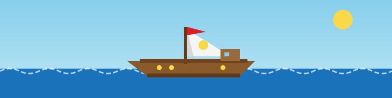
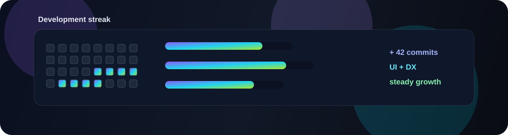
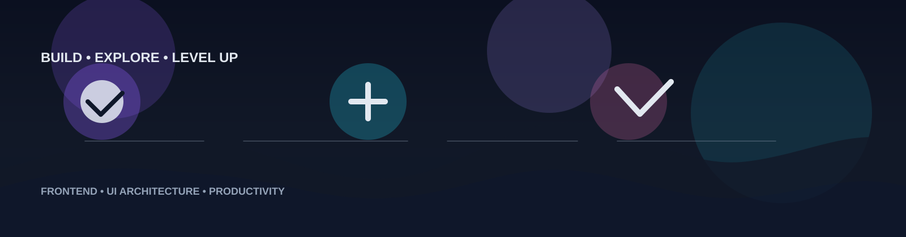

<!-- ========================================================= -->

<!--                    DEVELOPER HEADER                       -->

<!-- ========================================================= -->

  

<h1>👨‍💻 Hey there, I'm JP Prakash</h1>

  <samp>
    ⚡ DEVELOPMENT SYSTEM ONLINE • FRONTEND DEVELOPER • BUILDING THE NEXT INTERFACE
  </samp>

  

  
  
  

  <samp>
    ⚡ SYSTEM ID: JP-PRAKASH
    &nbsp; | &nbsp;
    CLASS: FRONTEND DEVELOPER
    &nbsp; | &nbsp;
    FOCUS: MODERN FRONTEND
  </samp>

---

<!-- ========================================================= -->

<!--          DEVELOPER PROFILE + DEVELOPER STATS             -->

<!-- ========================================================= -->

## ⚡ DEVELOPER PROFILE

<table border="0" width="94%" cellpadding="18" cellspacing="0">
<tr>

<td width="50%" valign="top">

  <h3 align="center">👨‍💻 Developer Profile</h3>

  
 <samp>「CRAFTING MODERN INTERFACES FOR THE NEXT GENERATION OF THE WEB」</samp> 
   
  <ul>
    <li>🧑‍💻 
      <b>Role&nbsp;:</b> Frontend Developer · UI Engineer
    </li>
     
    <li>🎨 
      <b>Specialty&nbsp;:</b> UI/UX · Modern Interfaces · Design Systems
    </li>
     
    <li>⚛️ 
      <b>Core&nbsp;:</b> React.js · Next.js · Redux
    </li>
     
    <li>🧠 
      <b>Languages&nbsp;:</b> JavaScript · TypeScript
    </li>
     
    <li>✨ 
      <b>Interface Craft&nbsp;:</b> Responsive · Accessible · Pixel-Perfect
    </li> 
     
    <li>🛠️ 
      <b>Engineering&nbsp;:</b> Architecture · Refactoring · Performance
    </li> 
     
    <li>🧪 
      <b>Quality&nbsp;:</b> E2E Testing · UI Automation
    </li> 
     
    <li>🤖 
      <b>Exploring&nbsp;:</b> AI × Frontend · Intelligent Interfaces
    </li>
     
    <li>🚀 
      <b>Mission&nbsp;:</b> Scalable · Performant · User-Centric
    </li>
     
    <li>💎 
      <b>Mindset&nbsp;:</b> Learn · Build · Refine · Repeat
    </li> 
  </ul>
</td>

<td width="50%" valign="top">

<h3 align="center">📊 Developer Stats</h3>

 
<!-- Frontend --> 

 
 <b>Frontend</b> <b>95%</b> 
  
 
<!-- React --> 

 
 <b>React</b> <b>90%</b> 
  
 
<!-- JavaScript --> 

 
 <b>JavaScript</b> <b>95%</b> 
  
 
<!-- TypeScript --> 

 
 <b>TypeScript</b> <b>80%</b> 
  
 
<!-- UI Engineering --> 

 
 <b>UI Engineering</b> <b>90%</b> 
  
 
<!-- Automation --> 

 
 <b>Automation</b> <b>85%</b> 
  
 
<!-- Problem Solving --> 

 
 <b>Problem Solving</b> <b>90%</b> 
  
 
<!-- Learning --> 

 
 <b>Learning</b> <b>100%</b> 
  
 

</td>

</tr>

   
  <samp>⚔️ DESIGN · ENGINEER · OPTIMIZE · EVOLVE</samp>
  &nbsp;&nbsp;&nbsp;•&nbsp;&nbsp;&nbsp;
  <samp>⚡ FOCUS: MODERN FRONTEND</samp>
    

</table>

---

<!-- ========================================================= -->

<!--                       TECH STACK                          -->

<!-- ========================================================= -->

## 🛠️ TECH STACK

  <samp>
    ╔══════════════ ⚡ DEVELOPER ABILITIES ⚡ ══════════════╗
  </samp>

  

  

<table border="0" width="94%" cellpadding="12">
<tr>

<td width="50%" align="center">

### 🌊 FRONTEND

`JavaScript` · `TypeScript`
`React.js` · `Next.js` · `Angular`
`HTML5` · `CSS3` · `Bootstrap`
`Responsive Web Design`

</td>

<td width="50%" align="center">

### ⚡ STATE & ARCHITECTURE

`Redux` · `Context API`
`React Hooks` · `REST APIs`
`Component Architecture`
`Performance Optimization`

</td>

</tr>

<tr>

<td align="center">

### 🧪 TESTING & AUTOMATION

`Selenium` · `Mocha` · `TestNG`
`E2E Automation`
`UI Automation`

</td>

<td align="center">

### 🧭 ENGINEERING

`Git` · `GitHub` · `Jenkins`
`Node.js` · `Express.js`
`MySQL` · `SQLite` · `Jira`

</td>

</tr>
</table>

  <samp>
    ╚════════════════════════════════════════════════════════╝
  </samp>

---

<!-- ========================================================= -->

<!--                    GITHUB ANALYTICS                       -->

<!-- ========================================================= -->

## 📊 DEVELOPER ANALYTICS

 

<samp>「 SYSTEM LOG — GITHUB ACTIVITY 」</samp>

 

<h2>⚡ GitHub Activity</h2>

  <strong>Prakash996</strong> · Building · Learning · Shipping 🚀

  

---

<!-- ========================================================= -->

<!--                 CONTRIBUTION TRACKER                      -->

<!-- ========================================================= -->

## ⚡ DAILY QUEST — CONTRIBUTION TRACKER

  <samp>
    ╔══════════════════════════════════════════════════════════╗ 
    ║                  ⚡ DAILY QUEST SYSTEM                   ║ 
    ╠══════════════════════════════════════════════════════════╣ 
    ║ QUEST &nbsp;&nbsp;: CONTRIBUTE TO THE CODEBASE              ║ 
    ║ TARGET &nbsp;&nbsp;: BUILD • LEARN • COMMIT                 ║ 
    ║ REWARD &nbsp;&nbsp;: +EXP • +SKILL • +LEVEL                 ║ 
    ║ STATUS &nbsp;&nbsp;: 🟢 ACTIVE                              ║ 
    ╚══════════════════════════════════════════════════════════╝
  </samp>

  

  <samp>
    ⚡ [DAILY QUEST: COMMIT TO THE CORE COMPLETED]
  </samp>

---

<!-- ========================================================= -->

<!--                     CURRENT ARC                           -->

<!-- ========================================================= -->

## 🚀 CURRENT DEVELOPMENT JOURNEY

<table border="0" width="94%" cellpadding="15">
<tr>

<td align="center">

### ⚡ LEVEL 01

**REACT MASTERY**

`Hooks`
`Redux`
`Next.js`

</td>

<td align="center">

### 🧠 LEVEL 02

**UI ARCHITECTURE**

`Scalability`
`Performance`
`Clean UI`

</td>

<td align="center">

### 🤖 LEVEL 03

**AI + FRONTEND**

`AI Tools`
`Automation`
`Productivity`

</td>

</tr>
</table>

---

<!-- ========================================================= -->

<!--                     LET'S CONNECT                         -->

<!-- ========================================================= -->

## 🧭 LET'S CONNECT

  <samp>
    「 GREAT SOFTWARE IS BUILT BY GREAT DEVELOPERS. 」 
  </samp>

  
  
  
  
  

 

  <samp>
    ⚡ BUILD • EXPLORE • LEARN • COMMIT • REPEAT ⚡
  </samp>

---

<!-- ========================================================= -->

<!--                         FOOTER                             -->

<!-- ========================================================= -->

  

<h2>⚡ THE DEVELOPMENT JOURNEY CONTINUES...</h2>

  <samp>
    ⚡ SYSTEM: ONLINE
    &nbsp; • &nbsp;
    DEVELOPER: JP PRAKASH
    &nbsp; • &nbsp;
    FOCUS: MODERN FRONTEND
    &nbsp; • &nbsp;
    DESTINATION: THE NEXT INTERFACE
  </samp>

  <samp>「 I'M GOING TO BUILD THE NEXT GREAT INTERFACE! 」</samp>

  ⚡ Code • Build • Explore • Level Up ⚡

