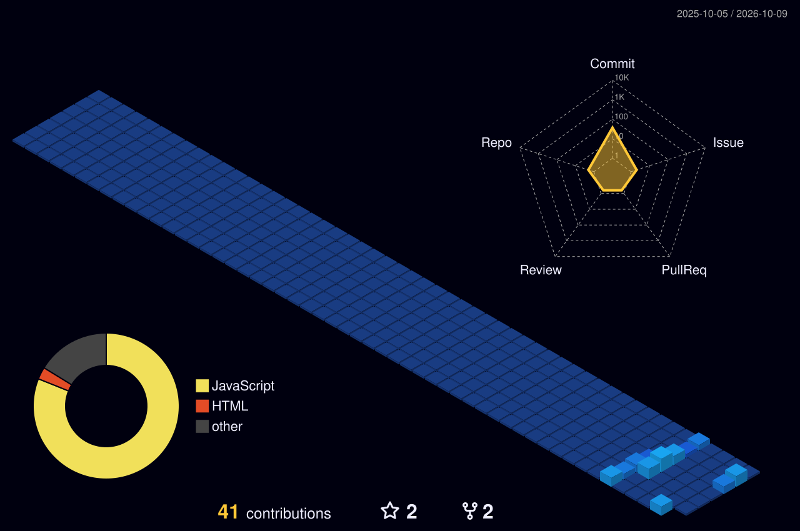

<a href="https://github.com/Prakash996">GitHub</a> &nbsp;•&nbsp;
<a href="https://linkedin.com/in/jp-prakash996/">LinkedIn</a> &nbsp;•&nbsp;
<a href="https://jp-portfolio-six-mu.vercel.app">Portfolio</a> &nbsp;•&nbsp;
<a href="https://instagram.com/prakash_jakkula">Instagram</a> &nbsp;•&nbsp;
<a href="mailto:jakkula28prakash@gmail.com">Email</a>

  

  

  

## Projects

### [JP Portfolio](https://jp-portfolio-six-mu.vercel.app)

A personal portfolio featuring an animated landing experience, profile and skills sections, project and experience views, resume access, contact actions and responsive navigation.

**Built with:** React 19 · Vite · Redux Toolkit · Tailwind CSS · Motion · Lucide React  
**Live:** [jp-portfolio-six-mu.vercel.app](https://jp-portfolio-six-mu.vercel.app)

### More on GitHub

| Repository | What it is | Language |
| --- | --- | --- |
| [Jp_portfolio](https://github.com/Prakash996/Jp_portfolio) | Public repository | JavaScript |
| [pattern_dynamics_webpage](https://github.com/Prakash996/pattern_dynamics_webpage) | A sample web page built while working as an intern | HTML |
| [MyRepo-Jakkula.Prakash](https://github.com/Prakash996/MyRepo-Jakkula.Prakash) | HCL PNP Vijayawada assignments | C |

## 3D Contribution City

> The image above is generated by [yoshi389111/github-profile-3d-contrib](https://github.com/yoshi389111/github-profile-3d-contrib) through `.github/workflows/github-profile-3d.yml`. It appears after the workflow's first run.

## Connect

<a href="https://github.com/Prakash996">GitHub</a> &nbsp;•&nbsp;
<a href="https://linkedin.com/in/jp-prakash996/">LinkedIn</a> &nbsp;•&nbsp;
<a href="https://jp-portfolio-six-mu.vercel.app">Portfolio</a> &nbsp;•&nbsp;
<a href="https://instagram.com/prakash_jakkula">Instagram</a> &nbsp;•&nbsp;
<a href="mailto:jakkula28prakash@gmail.com">Email</a>

