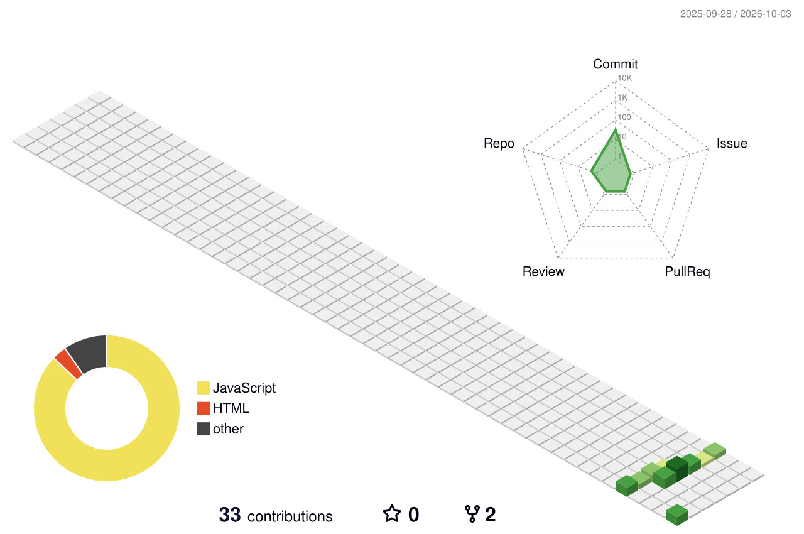

  

## About Me / Life

## Tech Stack

## ID Dashboard

## Projects

### [JP Portfolio](https://jp-portfolio-six-mu.vercel.app)

A personal portfolio featuring an animated landing experience, profile and skills sections, project and experience views, resume access, contact actions, and responsive navigation.

**Built with:** React 19, Vite, Redux Toolkit, Tailwind CSS, Motion, and Lucide React.

## 3D Contribution City

## Connect

