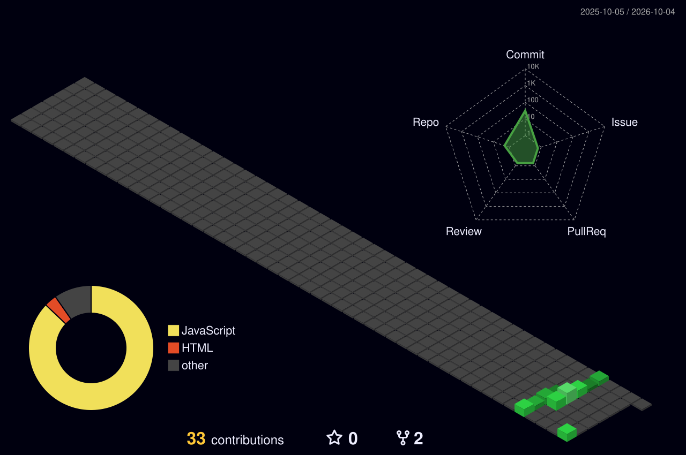

<picture>
  <source media="(prefers-color-scheme: dark)" srcset="assets/hero-dark.svg?v=3">
  <source media="(prefers-color-scheme: light)" srcset="assets/hero-light.svg?v=3">
  
</picture>

<a href="https://jp-portfolio-six-mu.vercel.app">Portfolio</a> &nbsp;•&nbsp;
<a href="#projects">Projects</a> &nbsp;•&nbsp;
<a href="#contributions">Contributions</a> &nbsp;•&nbsp;
<a href="#connect">Connect</a>

  

<picture>
  <source media="(prefers-color-scheme: dark)" srcset="assets/about-life-dark.svg?v=3">
  <source media="(prefers-color-scheme: light)" srcset="assets/about-life-light.svg?v=3">
  
</picture>

  

<picture>
  <source media="(prefers-color-scheme: dark)" srcset="assets/stack-dark.svg?v=3">
  <source media="(prefers-color-scheme: light)" srcset="assets/stack-light.svg?v=3">
  
</picture>

  

<picture>
  <source media="(prefers-color-scheme: dark)" srcset="assets/id-dashboard-dark.svg?v=3">
  <source media="(prefers-color-scheme: light)" srcset="assets/id-dashboard-light.svg?v=3">
  
</picture>

## Projects

| Project | What it is | Built with | Links |
| :-- | :-- | :-- | :-- |
| **JP Portfolio** | Personal portfolio with an animated landing, profile and skills, project and experience views, resume access, contact actions and responsive navigation. | React 19 · Vite · Redux Toolkit · Tailwind CSS · Motion · Lucide React | [Live site](https://jp-portfolio-six-mu.vercel.app) · [Source](https://github.com/Prakash996/Jp_portfolio) |
| **pattern_dynamics_webpage** | A sample web page built while working as an intern. | HTML | [Source](https://github.com/Prakash996/pattern_dynamics_webpage) |
| **MyRepo-Jakkula.Prakash** | HCL PNP Vijayawada assignments. | C | [Source](https://github.com/Prakash996/MyRepo-Jakkula.Prakash) |

## Contributions

<picture>
  <source media="(prefers-color-scheme: dark)" srcset="profile-3d-contrib/profile-night-green.svg">
  <source media="(prefers-color-scheme: light)" srcset="profile-3d-contrib/profile-green.svg">
  
</picture>

Generated daily by [github-profile-3d-contrib](https://github.com/yoshi389111/github-profile-3d-contrib) through `.github/workflows/github-profile-3d.yml`.

## Connect

<picture>
  <source media="(prefers-color-scheme: dark)" srcset="assets/connect-dark.svg?v=3">
  <source media="(prefers-color-scheme: light)" srcset="assets/connect-light.svg?v=3">
  
</picture>

<a href="https://github.com/Prakash996"><picture>
  <source media="(prefers-color-scheme: dark)" srcset="assets/links/link-github-dark.svg?v=3">
  <source media="(prefers-color-scheme: light)" srcset="assets/links/link-github-light.svg?v=3">
  
</picture></a>
<a href="https://linkedin.com/in/jp-prakash996/"><picture>
  <source media="(prefers-color-scheme: dark)" srcset="assets/links/link-linkedin-dark.svg?v=3">
  <source media="(prefers-color-scheme: light)" srcset="assets/links/link-linkedin-light.svg?v=3">
  
</picture></a>
<a href="https://jp-portfolio-six-mu.vercel.app"><picture>
  <source media="(prefers-color-scheme: dark)" srcset="assets/links/link-portfolio-dark.svg?v=3">
  <source media="(prefers-color-scheme: light)" srcset="assets/links/link-portfolio-light.svg?v=3">
  
</picture></a>
<a href="https://instagram.com/prakash_jakkula"><picture>
  <source media="(prefers-color-scheme: dark)" srcset="assets/links/link-instagram-dark.svg?v=3">
  <source media="(prefers-color-scheme: light)" srcset="assets/links/link-instagram-light.svg?v=3">
  
</picture></a>
<a href="mailto:jakkula28prakash@gmail.com"><picture>
  <source media="(prefers-color-scheme: dark)" srcset="assets/links/link-email-dark.svg?v=3">
  <source media="(prefers-color-scheme: light)" srcset="assets/links/link-email-light.svg?v=3">
  
</picture></a>

